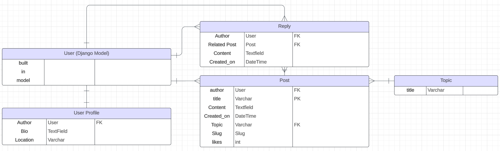
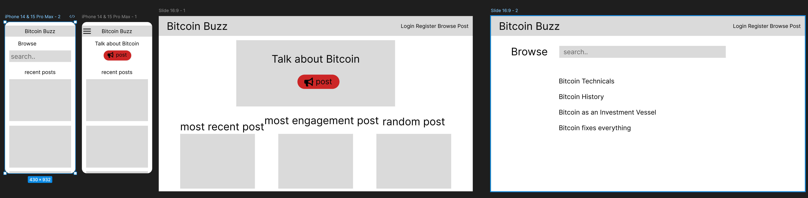

# Bitcoin BUZZ: Bitcoin-Themed Forum

Bitcoin Forum is a community-driven platform designed for Bitcoin enthusiasts to discuss, share insights, and stay updated on all things Bitcoin. The goal of this project is to create an engaging and user-friendly forum where users can create posts, participate in discussions, and interact with like-minded individuals on various topics related to Bitcoin.

**deployed site: [https://bitcoin-buzz-cbbef11893a0.herokuapp.com/]**


# Table of Content

* [**Goals**](<#goals>)
    * [External User's Goal](<#external-users-goal>)
    * [Site Owners Goal](<#site-owners-goal>)
* [**User Experience (UX)**](#user-experience)
    * [Entity Relationship Diagram (ERD)](#entity-relationship-diagram-erd)
    * [Wireframes](#wireframes)
    * [User Stories](#user-stories)
    * [Site Structure](#site-structure)
    * [Design Choices and Color Scheme](#design-choices-and-color-scheme)
* [**Features**](#features)
  * [Existing Features](#existing-features)
  * [Future Features](#future-features)
* [**Testing**](#testing)
* [**Deployment**](#deployment)
  * [Forking GitHub Repository](#forking-the-github-repository)
  * [Local Clone](#creating-a-local-clone)
* [**credits**](#credits)

# Goals

### External User’s Goal:
 Users can discuss Bitcoin, post topics, comment on posts, and engage in community discussions.
### Site Owner’s Goal:
 Provide a platform for Bitcoin enthusiasts to share knowledge, ask questions, and engage in discussions about Bitcoin.

[Back to top](<#table-of-content>)

# User Experience

## Entity Relationship Diagram (ERD)



## Wireframes

The wireframes were created with [Figma](figma.com) for desktop and mobile devices.



[Back to top](<#table-of-content>)

## User Stories 

Bitcoin BUZZ was developed using an agile approach. 
User Stories on GitHub Projects: [GitHub Projects Board](https://github.com/users/CsClown/projects/5)

### -User Story: Account Management
As a **visitor**, I can **register, log in, and log out** so that **I can access and interact with the forum as an authenticated user**.

#### Acceptance Criteria:
- Visitors can register a new account with a unique username and email.
- Registered users can log in using their credentials.
- Logged-in users can log out at any time.
- After logging in, users are redirected to the page they were previously on.
- After logging out, users are redirected to the homepage.

#### Tasks:
- Implement account registration using `allauth`.
- Set up login and logout functionality with `allauth`.
- Create `login.html`, `signup.html`, and any other necessary templates.
- Add links to register, log in, and log out in the navigation bar.
- Ensure proper redirection after login and logout.

### -User Story: Post Creation
As an **authenticated user**, I can **create a new post** so that **I can share my thoughts or questions with the community**.

#### Acceptance Criteria:
- The user must be authenticated to create a post.
- The post form must include a title, content, and topic.
- Upon submission, the post should be saved with the current user's details.
- The user is redirected to the conversation view of the newly created post.

#### Tasks:
- Create a `PostForm` for post creation.
- Implement `post_create` view with form handling.
- Ensure user authentication before accessing the post creation form.
- Redirect to the conversation view upon successful post creation.

### -User Story: Post Listing and Sorting
As a **user**, I can **view a list of posts** so that **I can browse through discussions**.

#### Acceptance Criteria:
- Posts can be sorted by the latest, most discussed, and most liked.
- The post list shows title, author, likes, and reply count.
- Each post links to its respective conversation view.

#### Tasks:
- Implement the `PostList` view with sorting options.
- Create the `index.html` template to display the list of posts.
- Add sorting buttons to the template.
- Annotate posts with likes and reply counts for sorting.

### -User Story: Conversation View
As a **user**, I can **view a detailed conversation** so that **I can read and engage with the full discussion**.

#### Acceptance Criteria:
- The conversation view shows the post details and all related replies.
- The user can reply to the post if authenticated.
- The user can see the number of likes and replies on the post.

#### Tasks:
- Implement the `conversation` view to fetch post details and related replies.
- Create the `conversation.html` template.
- Include a form for posting replies.
- Display the number of likes and replies.

### -User Story: Edit or Delete Reply
As an **authenticated user**, I can **edit or delete my reply** so that **I can correct mistakes, update my response, or remove it entirely**.

#### Acceptance Criteria:
- The user must be authenticated and the author of the reply to edit or delete it.
- The edit and delete options are only available for the user's own replies.
- The reply form is pre-filled with the existing reply content during editing.
- Upon submission, the updated reply replaces the original.
- Upon deletion, the reply is removed from the conversation.

#### Tasks:
- Implement the `reply_edit` view to handle reply editing.
- Implement the `reply_delete` view to handle reply deletion.
- Add "Edit" and "Delete" buttons next to each user's own reply in the conversation view.
- Ensure the form is pre-filled with the existing content and updates the reply on submission.
- Handle deletion with a confirmation prompt before removing the reply.

### -User Story: Delete Post
As an **authenticated user**, I can **delete my post** so that **I can remove content I no longer wish to share**.

#### Acceptance Criteria:
- The user must be authenticated and the author of the post to delete it.
- The delete option is only available for the user's own posts.
- Upon deletion, the post and all associated replies are removed from the forum.
- The user is redirected to the homepage after deletion with a success message.

#### Tasks:
- Implement the `post_delete` view to handle post deletion.
- Add a "Delete" button next to each user's own post in the conversation or post list views.
- Handle deletion with a confirmation prompt before removing the post and its replies.
- Redirect to the homepage after successful deletion with an appropriate message.

### -User Story: User Profiles
As a **user**, I can **view and edit my profile** so that **I can manage my personal information and see my posts**.

#### Acceptance Criteria:
- The profile page shows the user's details and a list of their posts.
- Authenticated users can edit their own profiles.
- The profile edit form allows updating location and bio.

#### Tasks:
- Implement the `UserProfile` model.
- Create views for displaying and editing profiles.
- Create `profile.html` and `edit_profile.html` templates.
- Link profile pages from posts and other relevant places.

### -User Story: Like a Post
As a **user**, I can **like a post** so that **I can express my appreciation for valuable content**.

#### Acceptance Criteria:
- The user can only like a post if authenticated.
- The like button should toggle between like and unlike states.
- The total likes are updated instantly.

#### Tasks:
- Implement the `like_post` view.
- Create the like button functionality in the template.
- Use AJAX for updating the like count without a page reload.

### -User Story: Browse Topics
As a **user**, I can **browse topics** so that **I can find posts related to specific areas of interest**.

#### Acceptance Criteria:
- The topics list displays all available topics.
- Clicking on a topic shows all related posts.
- Each topic shows the number of posts associated with it.

#### Tasks:
- Implement the `TopicList` and `TopicPostList` views.
- Create the `topic_list.html` and `topic_posts.html` templates.
- Link the topics list from the navigation or homepage.

[Back to top](<#table-of-content>)

# Site Structure

The **Bitcoin Forum** is organized to provide users with an intuitive and seamless experience as they navigate through various topics and discussions. The site structure is designed to cater to both new visitors and returning users, making it easy to find and engage with content.

### Homepage
The homepage serves as the central hub where users can view the latest posts, most discussed topics, and the most liked content. Users can quickly jump into discussions or browse posts based on their interests. The homepage also features sorting options to help users find content relevant to their preferences.

### User Authentication
Visitors can easily sign up, log in, and log out through the user authentication system. Once logged in, users can create posts, reply to discussions, and like posts. The site ensures that only authenticated users can engage in community interactions, maintaining a secure and trustworthy environment.

### Topics
The forum is divided into multiple topics, each representing a specific area of interest related to Bitcoin. Users can browse through these topics to find discussions that align with their interests. Each topic page lists all posts associated with that particular topic, allowing users to focus on the content that matters most to them.

### Conversation View
Each post has its own dedicated conversation view, where users can read the full content of the post and all related replies. This view also allows users to contribute to the discussion by adding their own replies, and it displays the number of likes and replies, fostering a sense of community interaction.

### User Profiles
Every registered user has a profile page that displays their personal information, bio, and a list of their posts. Users can edit their profile details, such as their location and bio, ensuring that they can present themselves in a way that reflects their identity within the community.

### Reply Management
Users have the ability to manage their own replies, including options to edit or delete them. However, posts themselves cannot be edited after they are published. This policy ensures that the integrity of the original discussion is maintained, preventing alterations that could change the context or meaning of the conversation. Users can still correct or update their views by posting a new reply or reopen a thread by making a new Post.

# Design Choices and Color Scheme

The **Bitcoin Forum** is designed with a thoughtful combination of modern typography, a cohesive color palette, and responsive layout principles to create an engaging and visually appealing user experience. The design choices aim to balance readability, user interaction, and brand identity, ensuring the forum is both functional and aesthetically pleasing.

#### Typography
The entire site utilizes the 'Oswald' font family, a sans-serif typeface that conveys a clean, professional, and modern look. The font is applied across all text elements, including headers, paragraphs, and buttons, ensuring consistency in visual style. The use of increased letter spacing (+1px) enhances readability and gives the text a sleek, contemporary feel.

#### Color Scheme
The color scheme of the forum is carefully curated to evoke a sense of trust, reliability, and vibrancy, key attributes associated with the Bitcoin community.

- **Primary Colors**: The primary color palette includes shades of **orange** and **dark orange**, used extensively for buttons, links, and interactive elements. These colors are chosen for their energetic and inviting nature, encouraging user engagement.

- **Backgrounds and Containers**: The background color of the body is a light grayish-blue, creating a neutral and calm backdrop that contrasts well with the vibrant interactive elements. Content areas like cards use a white background with a subtle border, contributing to a clean and uncluttered interface.

- **Headers and Text**: Headers and text in content-heavy areas utilize darker shades like **dark blue-gray** and **light gray** to ensure high contrast and readability. The use of these colors in combination with the 'Oswald' font reinforces the site’s professional and modern aesthetic.

- **Interactive Elements**: Icons, buttons, and links are highlighted with **orange** and its darker variant, which change on hover to indicate interactivity. This not only makes the site more dynamic but also helps guide user actions.

#### Custom CSS and Bootstrap Integration
The design seamlessly integrates Bootstrap’s responsive grid system and utility classes with custom CSS, enabling flexibility and consistency across different screen sizes. 

[Back to top](<#table-of-content>)

# Features

## Existing Features 

The **Bitcoin Forum** is packed with a variety of features designed to enhance user interaction and create a dynamic community experience. From intuitive user profiles to interactive discussions, every feature is carefully crafted to foster engagement and provide value to the Bitcoin community.

### User Authentication
- **Seamless Registration and Login**: New users can easily sign up and log in to access all the forum’s features. The platform ensures a secure and smooth authentication process using Django Allauth, allowing users to focus on participating in discussions without hassle.
- **Session Management**: Logged-in users can enjoy persistent sessions, with the option to log out when needed. Upon logging in, users are redirected back to the page they were viewing, ensuring continuity in their experience.

### Posts and Discussions
- **Create and Share Posts**: Authenticated users can create posts under specific topics, sparking new discussions or seeking advice from the community. Each post serves as the starting point for in-depth conversations on various Bitcoin-related subjects.
- **Topic-Based Organization**: Posts are categorized under distinct topics, making it easy for users to browse content that aligns with their interests. Whether it’s Bitcoin Mining or Bitcoin Regulation, users can dive deep into focused discussions.

### Conversation View
- **Engage in Discussions**: The conversation view allows users to read entire discussions, including all replies to a post. This view is central to the forum experience, providing a comprehensive look at community interactions.
- **Like Posts**: Users can express their appreciation for valuable content by liking posts. The like button provides immediate feedback, visually indicating popular posts within the community.

### Reply Management
- **Interactive Replies**: Users can reply to posts, contributing their thoughts, answering questions, or engaging with other users. The reply feature is designed to promote continuous dialogue and knowledge sharing.
- **Edit and Delete Replies**: Users retain control over their contributions with the ability to edit or delete their replies. This ensures that users can correct errors or remove content they no longer wish to share, maintaining the integrity of their participation.

### User Profiles
- **Personalized Profiles**: Each user has a personalized profile page displaying their username, location, bio, and a list of their posts. This feature allows users to present their identity within the community and track their engagement.
- **Profile Editing**: Users can update their profile information, ensuring that their personal details and interests are always current. The profile page serves as a hub for users to manage their presence on the forum.

### Sorting and Browsing
- **Dynamic Sorting Options**: The homepage offers multiple sorting options, allowing users to view the latest posts, most discussed topics, or most liked content. This feature enhances content discovery and keeps the most relevant discussions in focus.
- **Browse by Topic**: Users can easily browse posts by specific topics, streamlining the process of finding discussions that match their interests. This organized approach helps users stay engaged with the content that matters most to them.

### Responsive Design
- **Mobile-Friendly Layout**: The Bitcoin Forum is designed with responsiveness in mind, ensuring a seamless experience across all devices. Whether on desktop, tablet, or mobile, users can navigate and interact with the forum effortlessly.
- **Clean and Modern Aesthetics**: The forum’s design combines modern typography with a balanced color scheme, creating a visually appealing interface that enhances readability and user engagement.

### Accessibility
- **Clear Navigation**: The site structure is straightforward, with intuitive navigation that makes it easy for users to find their way around the forum. Clear links and buttons guide users to important sections like topics, profiles, and the homepage.
- **User Feedback**: Interactive elements like buttons and links provide immediate visual feedback on hover and click, ensuring that users know their actions are registered.

### Security and Privacy
- **Protected Content**: Only authenticated users can create posts, reply, or like content, ensuring that all interactions are traceable to registered accounts. This helps maintain a safe and trustworthy environment for discussions.
- **User Control**: Users have full control over their posts and replies, with the ability to delete content they no longer want visible on the forum. This respects user privacy and content ownership.

[Back to top](<#table-of-content>)


## Future Features

As the **Bitcoin Forum** continues to grow, several exciting features are planned to further enhance user experience and community interaction:

- **Advanced Search Functionality**: Implement a robust search feature that allows users to quickly find posts, topics, and users based on keywords, tags, and filters.
- **Private Messaging**: Enable direct messaging between users, fostering private discussions and connections within the community.
- **Notification System**: Introduce a notification system to alert users of replies, likes, and new posts in topics they follow.
- **Dark Mode**: Offer a dark mode option for users who prefer a darker interface, improving usability in low-light environments.
- **Post Moderation Tools**: Develop moderation tools to help manage content, ensuring the forum remains a safe and respectful space for discussion.

These future enhancements aim to make the Bitcoin Forum even more interactive, user-friendly, and community-driven.

[Back to top](<#table-of-content>)

# Technologies Used

## Languages

* [Python](https://en.wikipedia.org/wiki/Python_(programming_language)) - Provides the functionality for the site.
* [HTML5](https://en.wikipedia.org/wiki/HTML) - Provides the content and structure for the website.
* [CSS3](https://en.wikipedia.org/wiki/CSS) - Provides the styling for the website.
* [JavaScript](https://en.wikipedia.org/wiki/JavaScript) - Provides interactive elements of the website

## Frameworks & Software
* [Gitpod](http://gitpod.io) - Cloud based IDE
* [Bootstrap](https://getbootstrap.com/) - A CSS framework that helps building solid, responsive, mobile-first sites
* [Django](https://www.djangoproject.com/) - A model-view-template framework used to create the Review | Alliance site
* [Figma](https://Figma.com/) - Used to create the wireframe.
* [Github](https://github.com/) - Used to host and edit the website.
* [Heroku](https://en.wikipedia.org/wiki/Heroku) - A cloud platform that the application is deployed to.
* [Lighthouse](https://developer.chrome.com/docs/lighthouse/overview/) - Used to test performance of site.
* [Responsive Design Checker](https://www.responsivedesignchecker.com/) - Used for responsiveness check.
* [Wave Web Accessibility Evaluation Tool](https://wave.webaim.org/) - Used to validate the sites accessibility.
* [Favicon](https://favicon.io/) - Used to create the favicon.
* [Google Chrome DevTools](https://developer.chrome.com/docs/devtools/) - Used to debug and test responsiveness.
* [ChatGPT](http://chatgpt.com) AI tool for troubleshooting and repetitive tasks.
* [HTML Validation](https://validator.w3.org/) - Used to validate HTML code
* [CSS Validation](https://jigsaw.w3.org/css-validator/) - Used to validate CSS code
* [PEP8 Validation](http://pep8online.com/) - Used to validate code
* [JSHint Validation](https://jshint.com/) - Used to validate JavaScript code

[Back to top](<#table-of-content>)

## Testing

For detailed information on testing, please refer to the [TESTING.md](TESTING.md) file.


## Deployment

For good practice, this project was deployed early to [Heroku](https://www.heroku.com) in order to save time and avoid nasty surprises later on.

After installing Django and the supporting libraries, the basic Django project was created and migrated to the database. 

The database provided by Django [db.sqlite3](https://docs.python.org/3/library/sqlite3.html) is only accessible within the workspace environment. In order for Heroku to be able to access the database, a new database suitable for production needs to be created.  Heroku offers a postgres add-on at an extra charge. I am using a postgreSQL database instance hosted on [CI Database](https://dbs.ci-dbs.net/) as this service is free. 

<details>
<summary>Steps taken before deploying the project to Heroku</summary>

### Create the Heroku App

1. Login to Heroku and click on the top right button ‘New’ on the dashboard. 
2. Click ‘Create new app’.
3. Give your app a unique name and select the region closest to you. 
4. Click on the ‘Create app’ button.

### Create the PostgreSQL Database

1. Login to https://dbs.ci-dbs.net/.
2. step 1: enter your email address and submit.  
3. step 2: creates a database.  
4. step 3: receive the database link on your email id. 

### Create the env.py file

With the database created, it now needs to be connected with the project.  Certain variables need to be kept private and should not be published to GitHub.  

1. In order to keep these variables hidden, it is important to create an env.py file and add it to .gitignore.  
2. At the top **import os** and set the DATABASE_URL variable using the `os.environ` method. Add the URL copied from instance created above to it, like so:
`os.environ[“DATABASE_URL”] = ”copiedURL”`
3. The Django application requires a SECRET_KEY to encrypt session cookies.  Set this variable to any string you like or generate a secret key on this [MiniWebTool](https://miniwebtool.com/django-secret-key-generator/).
`os.environ[“SECRET_KEY”] = ”longSecretString”`

### Modify settings.py 

It is important to make the Django project aware of the env.py file and to connect the workspace to the new database. 

1. Open up the settings.py file and add the following code. The if statement acts as a safety net for the application in case it is run without the env.py file.
```
import os
import dj_database_url

if os.path.isfile(‘env.py’):
    import env
```
2. Remove the insecure secret key provided by Django and reference the variable set in the env.py file earlier, like so:
```
SECRET_KEY = os.environ.get(‘SECRET_KEY’)
```
3. Hook up the database using the dj_database_url import added above.  The original DATABASES variable provided by Django connects the Django application to the created db.sqlite3 database within your repo.  This database is not suitable for production so comment out the existing db.sqlite3 and include the command as below for the new database. 

```
# Database
# https://docs.djangoproject.com/en/5.0/ref/settings/#databases

# DATABASES = {
#   'default': {
#       'ENGINE': 'django.db.backends.sqlite3',
#       'NAME': BASE_DIR / 'db.sqlite3',
#   }
# }

DATABASES = {
    'default': dj_database_url.parse(os.environ.get("DATABASE_URL"))
}
```

**NOTE**: If at the start of the development you are using the local db.sqlite3, make sure to add it to the .gitignore file, so as not to make the mistake of pushing it to your repository.  

5. Save and migrate this database structure to the newly connected postgreSQL database.  Run the migrate command in your terminal
`python3 manage.py migrate`

### Connect the Database to Heroku

1. Open up the Heroku dashboard, select the project’s app and click on the ‘Settings’ tab.
2. Click on ‘Reveal Config Vars’ and add the DATABASE_URL with the value of the copied URL from the database instance created on CI database.
3. Also add the SECRET_KEY with the value of the secret key added to the env.py file. 
4. If using gitpod another key needs to be added in order for the deployment to succeed.  This is PORT with the value of 8000.

### Setup the Templates Directory

In settings.py, add the following under BASE_DIR 
`DIRS = os.path.join(BASE_DIR, "templates")`

### Add the Heroku Host Name

In settings.py scroll to ALLOWED_HOSTS and add the Heroku host name.  This should be the Heroku app name created earlier followed by `.herokuapp.com`.  Add in `’localhost’` so that it can be run locally.
```
ALLOWED_HOSTS = [‘heroku-app-name.herokuapp.com’, ‘localhost’]
```

### Create the Directories and the Process File

1. Create the media, static and templates directories at the top level next to the manage.py file. 
2. At the same level create a new file called ‘Procfile’ with a capital ‘P’.  This tells Heroku how to run this project.  
3. Add the following code, including the name of your project directory. 
```
web: gunicorn bitcoin_buzz.wsgi
```
* ‘web’ tells Heroku that this a process that should accept HTTP traffic.
* ‘gunicorn’ is the server used.
* ‘wsgi’, stands for web services gateway interface and is a standard that allows Python services to integrate with web servers.
4. Save everything and push to GitHub. 

</details>

<details>
<summary>First Deployment</summary>

### First Deployment

1. Go back to the Heroku dashboard and click on the ‘Deploy’ tab.  
2. For deployment method, select ‘GitHub’ and search for the project’s repository from the list. 
3. Select and then click on ‘Deploy Branch’.  
4. When the build log is complete it should say that the app has been successfully deployed.
5. Click on the ‘Open App’ button to view it and the Django “The install worked successfully!” page, should be displayed. 

</details>

<details>
<summary>Final Deployment</summary>

### Final Deployment

1. When development is complete, if you had left `DEBUG = True` in the settings.py file, make sure to change it to `False`. You don't have to change anything if you had used `DEBUG = 'DEVELOPMENT' in os.environ` as your env.py file is ignored by GitHub. 
2. Commit and push your code to your project's repository.
3. Then open up Heroku, navigate to your project's app. Click on the 'settings' tab, open up the config vars and delete the DISABLE_COLLECTSTATIC variable. 
4. Navigate to the 'Deploy' tab and scroll down to 'Deploy a GitHub branch'.
5. Select the branch you want to deploy and click on the 'Deploy branch' button. When the app is deployed, you should see a message in the built log saying "Your app was successfully deployed".  Click 'View' to see the deployed app in the browser. Alternatively, you can click on the 'Open App' button at the top of the page. 

</details>

_____

### Forking the GitHub Repository

<details>
<summary>Steps to Fork the GitHub Repository</summary>

Forking allows you to view and edit the code without affecting the original repository

1. Locate the GitHub repository. Link to this repository can be found [here](https://github.com/CsClown/bitcoin-buzz).
2. Click on 'Fork', in the top right-hand corner.
3. This will take you to your own repository to a fork with the same name as the original branch.

</details>

_____

### Creating a Local Clone

<details>
<summary>Steps to Creating a Local Clone</summary>

1. Go to the GitHub repository. Link to this repository can be found [here](https://github.com/CsClown/bitcoin-buzz).
2. Click on 'Code' to the right of the screen. This will open a dropdown. Click on HTTPs and copy the link.
3. Open Git Bash in your IDE and change the current working directory to the location where you want the cloned directory.
4. Type `git clone`, paste the URL you copied earlier, and press Enter to create your local clone.

More information on Creating and Managing repositories can be found [here](https://docs.github.com/en/repositories/creating-and-managing-repositories/cloning-a-repository)
<br>

</details>

[Back to top](<#table-of-content>)

# Credits

  * CodeInstitute Codestar Blog (LMS walkthrough) as starting point for my project. Modified and added to the code to my needs
  * the deployment section was beautifully done by https://github.com/Pramilashanmugam and found its way into my readme
  * fixtures for the database entries entirely created by chatGPT. thank you for the awesome usernames.
  * Hero section Image from (#https://unsplash.com)


# Acknowledgements
This site was created for Portfolio Project #4 (Full-Stack Tolkin) - Diploma in Full Stack Software Development Diploma at the [Code Institute](https://www.codeinstitute.net). 
I would like to thank my mentor [Precious Ijege](https://www.linkedin.com/in/precious-ijege-908a00168/) for relevant feedback during the project.

*Stefan Ruppe, 2024-08-29*

[Back to top](<#table-of-content>)
