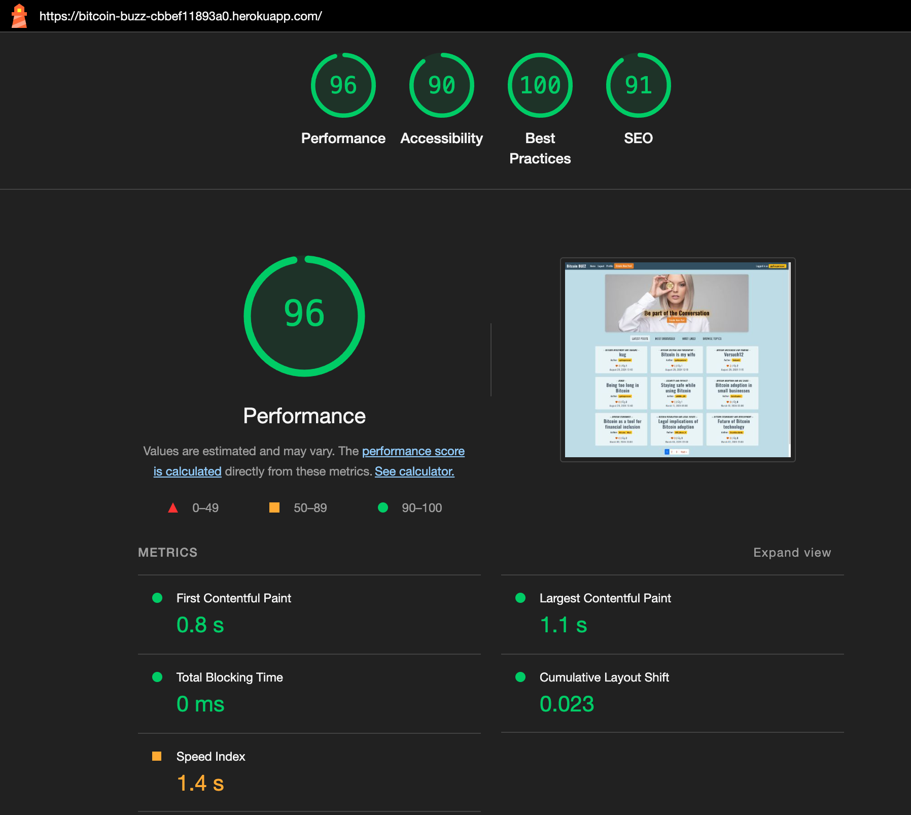

# Testing for the [Bitcoin BUZZ](#https://bitcoin-buzz-cbbef11893a0.herokuapp.com/) project 

# Table of content
* [**Manual Testing**](#manual-testing)

# Manual Testing

## Feature Testing Table

| Feature                         | Action                                                | Result                                                       |
|---------------------------------|-------------------------------------------------------|--------------------------------------------------------------|
| **User Registration**           | Submit registration form                              | New user account is created and user is redirected to homepage |
| **User Login**                  | Submit login form                                     | User is authenticated and redirected to the previous page     |
| **User Logout**                 | Click "Logout"                                        | User session is ended and user is redirected to the homepage  |
| **Create Post**                 | Click "Create New Post" button                        | Authenticated users are redirected to the post creation form; unauthenticated users are redirected to the login page |
| **Post Submission**               | Submit post creation form                             | New post is created and user is redirected to the conversation view |
| **View Post List**              | Visit homepage                                        | Latest posts are displayed with options to sort by likes or replies |
| **Sort Posts by Likes**         | Click "Most Liked" button                             | Posts are sorted by the number of likes in descending order   |
| **Sort Posts by Replies**       | Click "Most Discussed" button                         | Posts are sorted by the number of replies in descending order |
| **View Post Details**           | Click on a post title                                 | User is redirected to the conversation view showing the post details |
| **Reply to Post**               | Submit reply form                                     | New reply is added to the conversation and displayed below the post |
| **Edit Reply**                  | Click "Edit" on own reply                             | Reply form is pre-filled with existing content for editing    |
| **Delete Reply**                | Click "Delete" on own reply                           | Reply is removed from the conversation                        |
| **Like a Post**                 | Click "Heart" icon                                   | Post's like count increases and button reflects the "liked" state |
| **Un-Like a Post**                 | Click "Broken Heart" icon                          | Post's like count decreases and button reflects the "liked" state |
| **View User Profile**           | Click on author's name in post or reply               | User is redirected to the author's profile page displaying their details and posts |
| **Edit User Profile**           | Submit profile edit form                              | Profile information is updated and saved                      |
| **Browse Topics**               | Click "Browse Topics"                                 | User is redirected to the list of available topics            |
| **View Posts by Topic**         | Click on a specific topic                             | User is redirected to a list of posts related to the selected topic |
| **Navigation Links**            | Click navigation links (e.g., Home, Profile)          | User is redirected to the corresponding page without errors   |
| **Form Validation**             | Submit forms with invalid data (e.g., empty fields)   | Error messages are displayed, and the form is not submitted   |
| **Delete Post**                 | Click "Delete" on own post                            | Post is removed from the forum and user is redirected to the homepage with a success message |

### Responsiveness Test
The responsive design tests were carried out manually with [Google Chrome DevTools](https://developer.chrome.com/docs/devtools/) and [Responsive Design Checker](https://www.responsivedesignchecker.com/).

| Desktop    | Display <1280px       | Display >1280px    |
|------------|-----------------------|--------------------|
| Render     | pass                  | pass               |
| Images     | pass                  | pass               |
| Links      | pass                  | pass               |

| Tablet     | Samsung Galaxy Tab 10 | iPad Mini | iPad Pro |
|------------|-----------------------|-----------|----------|
| Render     | pass                  |   pass    | pass     |
| Images     | pass                  |   pass    | pass     |

| Phone      | Galaxy S5/S6/S7       | iPhone 3/4/4S      | iPhone 14 Pro Max    |
|------------|-----------------------|--------------------|----------------------|
| Render     | pass                  | pass               | pass      | pass     |
| Images     | pass                  | pass               | pass      | pass     |
| Links      | pass                  | pass               | pass      | pass     |

### Browser Compatibility
* Google Chrome (version 127.0.6533.120)
* Mozilla Firefox (version 129.0.2)
* Apple Safari (version 16.6)

### Lighthouse

Landing Page

