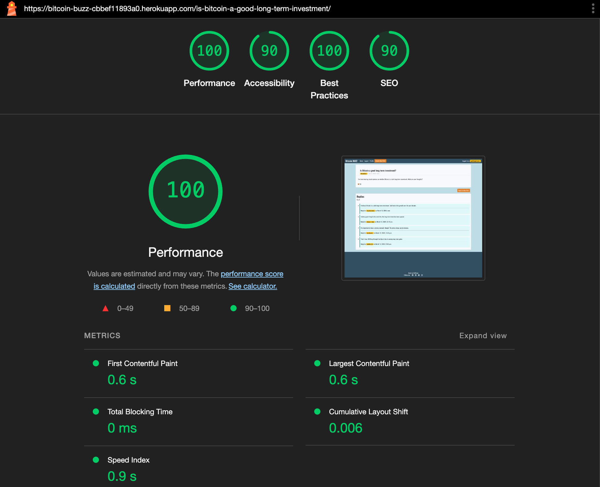
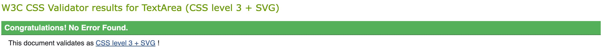
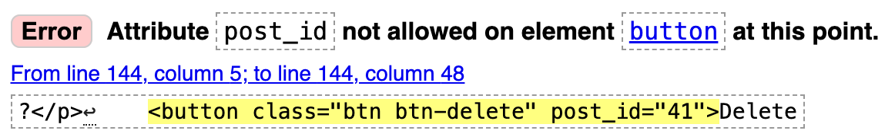
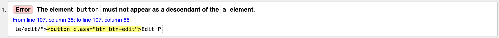
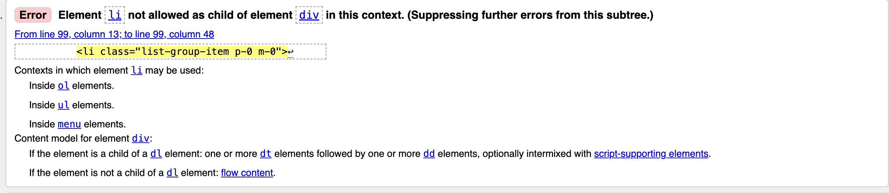

# Testing for the [Bitcoin BUZZ](#https://bitcoin-buzz-cbbef11893a0.herokuapp.com/) project 

### Table of Content
* [Manual Testing](#manual-testing)
  * [Feature Testing Table](#feature-testing-table)
  * [Responsiveness Test](#responsiveness-test)
  * [Browser Compatibility](#browser-compatibility)
* [Automated Testing](#automated-testing)
  * [Lighthouse](#lighthouse)
  * [W3 Validator](#w3-validator)
    * [HTML](#html)
    * [CSS](#css)
  * [CI Python Linter](#ci-python-linter)
  * [JShint](#jshint)
* [Bugs](#bugs)
  * [Known Bugs](#known-bugs)
  * [Encountered Validation Errors](#encountered-validation-errors)

# Manual Testing

## Feature Testing Table

| Feature                         | Action                                                | Result                                                       |
|---------------------------------|-------------------------------------------------------|--------------------------------------------------------------|
| **User Registration**           | Submit registration form                              | New user account is created and user is redirected to homepage |
| **User Login**                  | Submit login form                                     | User is authenticated and redirected to the previous page     |
| **User Logout**                 | Click "Logout"                                        | User session is ended and user is redirected to the homepage  |
| **Create Post**                 | Click "Create New Post" button                        | Authenticated users are redirected to the post creation form; unauthenticated users are redirected to the login page |
| **Post Submission**               | Submit post creation form                             | New post is created and user is redirected to the conversation view |
| **View Post List**              | Visit homepage                                        | Latest posts are displayed with options to sort by likes or replies |
| **Sort Posts by Likes**         | Click "Most Liked" button                             | Posts are sorted by the number of likes in descending order   |
| **Sort Posts by Replies**       | Click "Most Discussed" button                         | Posts are sorted by the number of replies in descending order |
| **View Post Details**           | Click on a post title                                 | User is redirected to the conversation view showing the post details |
| **Reply to Post**               | Submit reply form                                     | New reply is added to the conversation and displayed below the post |
| **Edit Reply**                  | Click "Edit" on own reply                             | Reply form is pre-filled with existing content for editing    |
| **Delete Reply**                | Click "Delete" on own reply                           | Reply is removed from the conversation                        |
| **Like a Post**                 | Click "Heart" icon                                   | Post's like count increases and button reflects the "liked" state |
| **Un-Like a Post**                 | Click "Broken Heart" icon                          | Post's like count decreases and button reflects the "liked" state |
| **View User Profile**           | Click on author's name in post or reply               | User is redirected to the author's profile page displaying their details and posts |
| **Edit User Profile**           | Submit profile edit form                              | Profile information is updated and saved                      |
| **Browse Topics**               | Click "Browse Topics"                                 | User is redirected to the list of available topics            |
| **View Posts by Topic**         | Click on a specific topic                             | User is redirected to a list of posts related to the selected topic |
| **Navigation Links**            | Click navigation links (e.g., Home, Profile)          | User is redirected to the corresponding page without errors   |
| **Form Validation**             | Submit forms with invalid data (e.g., empty fields)   | Error messages are displayed, and the form is not submitted   |
| **Delete Post**                 | Click "Delete" on own post                            | Post is removed from the forum and user is redirected to the homepage with a success message |

[Back to top](<#table-of-content>)

## Responsiveness Test
The responsive design tests were carried out manually with [Google Chrome DevTools](https://developer.chrome.com/docs/devtools/) and [Responsive Design Checker](https://www.responsivedesignchecker.com/).

| Desktop    | Display <1280px       | Display >1280px    |
|------------|-----------------------|--------------------|
| Render     | pass                  | pass               |
| Images     | pass                  | pass               |
| Links      | pass                  | pass               |

| Tablet     | Samsung Galaxy Tab 10 | iPad Mini | iPad Pro |
|------------|-----------------------|-----------|----------|
| Render     | pass                  |   pass    | pass     |
| Images     | pass                  |   pass    | pass     |

| Phone      | Galaxy S5/S6/S7       | iPhone 3/4/4S      | iPhone 14 Pro Max    |
|------------|-----------------------|--------------------|----------------------|
| Render     | pass                  | pass               | pass      | pass     |
| Images     | pass                  | pass               | pass      | pass     |
| Links      | pass                  | pass               | pass      | pass     |

## Browser Compatibility
* Google Chrome (version 127.0.6533.120)
* Mozilla Firefox (version 129.0.2)
* Apple Safari (version 16.6)

[Back to top](<#table-of-content>)

# Automated testing

## Lighthouse

Landing Page

Conversation View

## W3 Validator
 
### HTML
Due to the nature of the Django project and the template language i copy and pasted every single source code from every (deployed) page into the validator and it returned with no warnings or errors after i fixed some minor issues which get adressed in the [Bugs](#bugs) section

### CSS

No Errors found

## CI Python Linter

Adjusted the following python files to throw no error in the CI Python Linter

* views.py
* urls.py
* signals.py
* models.py
* forms.py
* apps.py
* admin.py

## JShint

JShint throws a few warnings about the requirement of ES6 as expected. 
Also it points out that the variable Bootstrap is unknown, but thats to be expected as well because
the bootstrap variable is provided by the Bootstrap JavaScript library, which is included via a script tag in the HTML. JSHint doesn't inherently know about external libraries unless you explicitly tell it that these variables are available in the environment.

[Back to top](<#table-of-content>)

# Bugs
## Known bugs

- when sorted by **most likes**, the posts in the list are missing the count of replies.
 I spent a good amount of time trying to fix this, but because i reckognized the bug pretty close to my submission deadline i decided to leave it and focus on finishing the project.

## Encountered validation errors
- custom data attributes:

 fix: added "data-" to custom attributes

- button nested inside of anchor element

fix: added btn classes to the anchor element

- li nested inside of div

fix: nested inside ul with class row and added bootstrap classes to li

[Back to top](<#table-of-content>)